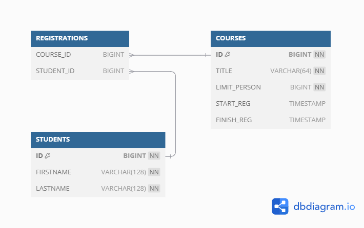

# **Сервис записи на учебный курс**

***Описание***

REST-микросервис обеспечивающий возможность записи на учебный курс.

***Функционал***

Приложение обеспечивает:

* Добавление курса, обновление курса, удаление курса. 
* Получение как списка вех курсов так и каждого по отдельности, с отображением списка участников.
* Добавление студента, обновление студента, удаление студента.
* Запись на курс и удаление себя из курса.

* На курс нельзя записаться:
** если студент уже записан на него, 
** если достигнут лимит по количеству студентов на курсе 

* Отписаться от курса можно только если студент был записан на него, после отписки количество свободных мест увеличивается 

***Структура хранения данных***

Диаграмма описывает структуру хранения данных приложения. Основные сущности приложения:
* Students - студенты
* Courses - курсы

Реализована связь "многие ко многим". Для избегания зацикливания при запросе предусмотрено исключения поля courses из метода ToString класса Student. Обеспечение работы сервиса достигается за счет использования оборачивается в одну транзакцию метода регистрации на курс. Во время выполнения метод блокирует строки в БД к которым происходит обращение с момента начала чтения, тем самым обеспечивается неизменность данных до завершения выполнения транзакции.
В случае отсутствия свободных мест предусмотрена обработка исключения.
Повторная запись на курс ограничена предварительной проверкой наличия студента на курсе. В случае выявления предусмотрена обработка исключения.

Ввод данных ограничивается валидацией. При несоответствии данных критериям вариации обрабатывается исключение.

В качестве дополнительной функциональности предусмотрена установка временных рамок на регистрацию на курс.
Поля границ временного интервала являются необязательными и могут принимать значение null.
Задать можно как одну границу, так и обе.
Для проверки времени запроса добавлен отдельный сервис. 

***Тестирование***

Тестирование выполнено с применением библиотеки Mokito. Основная часть тестов приходится на сервисный слой.
Тестирование контроллеров проводится с применением postman-коллекции course-selection\postman\Course_selection.postman_collection.json.

***Используемые технологии и библиотеки***

* Java 17
* Maven
* Spring Boot 
* PostgreSQL
* Hibernate
* Mockito
* Postman
